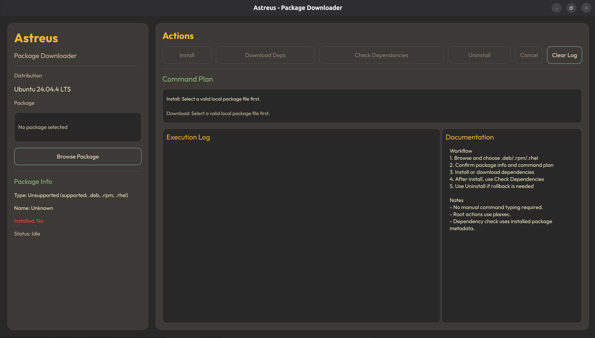

# Astreus - Package Downloader (Qt + QML)

A GDebi-style GUI package installer/downloader for Linux.

## What it does
- Browse local package files: `.deb`, `.rpm`, `.rhel`
- Detect package type and resolve package name from package metadata
- Install package with dependencies
- Download dependencies only
- Check installed package dependencies after install
- Uninstall installed package from the same interface
- Show command plan + live execution log
- No manual package-manager command typing required

## UI design
- Gruvbox-inspired visual theme
- Outfit font styling (falls back to system font if Outfit is unavailable)
- Two-panel structure similar to GDebi workflows:
  - left: package identity + status
  - right: actions, command plan, logs, documentation

## Current command strategy
- Debian packages:
  - Install: `apt install -y <package.deb>`
  - Download deps: `apt install --download-only -y <package.deb>`
  - Check deps: `dpkg -s <package-name>`
  - Uninstall: `apt remove -y <package-name>`
- RPM packages:
  - Install: `dnf install -y <package.rpm>` or `zypper --non-interactive install <package.rpm>`
  - Download deps: `dnf install --downloadonly -y <package.rpm>` or `zypper --non-interactive install --download-only <package.rpm>`
  - Check deps: `rpm -qR <package-name>`
  - Uninstall: `dnf remove -y <package-name>` or `zypper --non-interactive remove <package-name>`

Privileged commands run through `pkexec bash -lc '<command>'`.

## Build

```bash
cmake -S . -B build -DCMAKE_PREFIX_PATH=/home/g0x4d1cf/Qt/6.10.2/gcc_64
cmake --build build -j
```

## Run

```bash
./build/astreus-package-downloader
```

## Notes
- Linux only.
- `pkexec` must be configured.
- In production, add package signature verification and stronger policy checks.

## Here's how it looks

